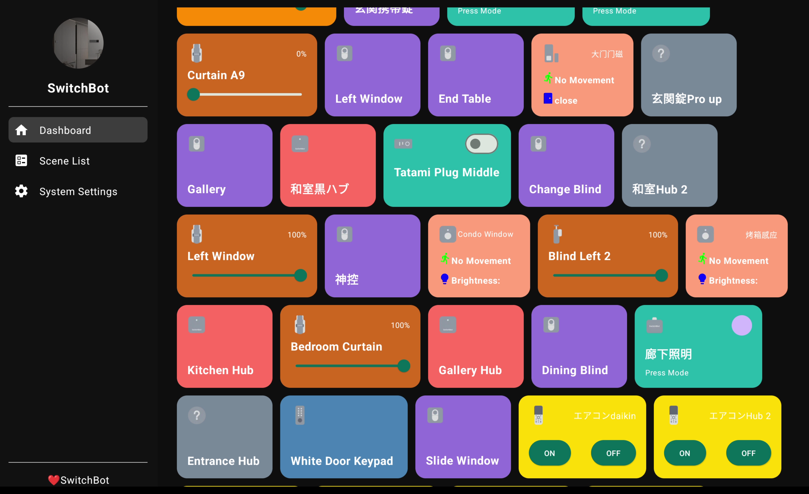
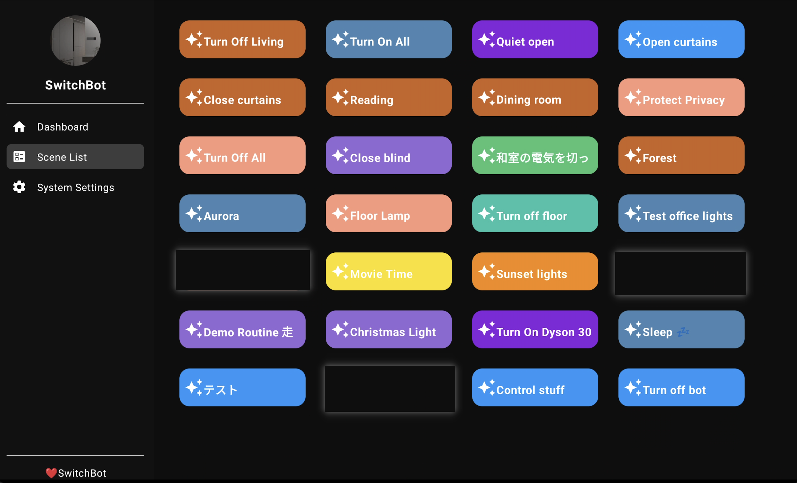
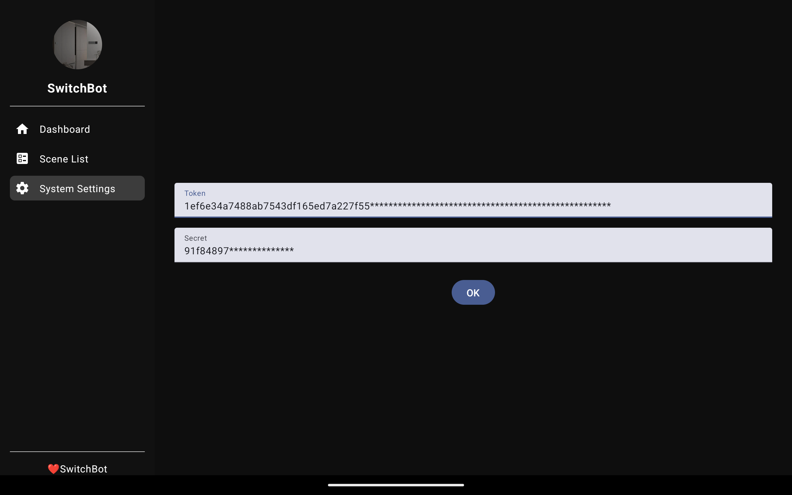

# SwitchBoard Android Application

SwitchBoard is an open-source Android tablet application designed to control SwitchBot smart home devices using Jetpack Compose for the UI, Ktor for network requests, and the official SwitchBotAPI. This application provides a convenient way to manage your SwitchBot devices through an Android tablet.

This project is maintained by developers in their spare time and may still have some issues. We hope capable community members can join in and help with maintenance.

## Features

- **Jetpack Compose**: Modern UI toolkit for building native Android interfaces.
- **Ktor**: Asynchronous networking library for making HTTP requests.
- **SwitchBotAPI**: Official API integration for controlling SwitchBot devices.
- **User Authentication**: Token and secret-based authentication for secure API access.
- **Device Control**: Easy management and control of SwitchBot devices.

## Getting Started

### Prerequisites

- Android Studio
- Kotlin 1.5+
- SwitchBot account and APP for obtaining API credentials

### Installation

1. **Clone the Repository**
   ```bash
   git clone https://github.com/yourusername/SwitchBoard.git
   cd SwitchBoard
   ```

2. **Open the Project in Android Studio**

3. **Set Up API Credentials**
   - Obtain your `token` and `secret` from the SwitchBot APP.
   - Add these credentials to your project's configuration.

### Usage

1. **Run the Application**
   - Connect your Android tablet to your development environment.
   - Run the project from Android Studio.

2. **Log In**
   - Enter your SwitchBot `token` and `secret` to authenticate and start controlling your devices.

## Project Structure

- `com.theswitchbot.switchboard.entity`: Contains the main entity classes for the application.
- `com.theswitchbot.switchboard.widget`: Houses the Jetpack Compose UI components.
- `com.theswitchbot.switchboard.vm`: Manages SwitchBotAPI calls and handles the application's logic.

## Documentation

For detailed information about the SwitchBotAPI, refer to the official [SwitchBotAPI Documentation](https://github.com/OpenWonderLabs/SwitchBotAPI).

## ScreenShot




## Contributing

We welcome contributions from the open-source community! If you're interested in helping maintain this project, please follow these steps:

1. **Fork the Repository**
   - Create a new branch for your feature or bug fix.

2. **Make Changes**
   - Implement your changes in the new branch.

3. **Submit a Pull Request**
   - Provide a clear description of your changes and submit a pull request for review.

## License

This project is licensed under the MIT License - see the [LICENSE](LICENSE) file for details.

## Contact

For questions or suggestions, please open an issue.

---

Thank you for using and contributing to SwitchBoard!